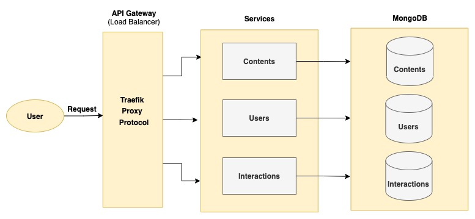

# Content Interactions Service - Microservices in Go with Docker, Traefik  and MongoDB

## Overview

 * User Service: allows basic CRUD operations like insert,update,delete User
 * Content Service: service to manage contents.
 * Interactions Service: service to manage interaction activities (read,like, get most viewed item,get most liked items).
 * Users Service: Provides movie suggestions for users by communicating with other services.

Container images used support multi-architectures (amd64, arm/v7 and arm64).

## Index

* [Deployment](#deployment)
* [Endpoints](#endpoints)
* [Path To Swagger Documentation](#swagger-documentation)
* [Postman Collection](#postman-collection)
* [Sample CSV For Bulk Upload](#sample-csv-for-bulk-upload)
* [Architecture](#architecture)
* [References](#references)

## Deployment
Deploy service using docker compose
* [local machine (docker compose)](./docs/localhost.md)

## Endpoints

* [endpoints](./docs/endpoints.md)

## Swagger Documentation

after deploying the application, swagger documentations will be available on:

    localhost:9000/{service}/docs/index.html

service --> [users,interactions,contents]

## Postman Collection

* [postman collection](docs/pratilipi-assessment.postman_collection.json)

## Sample CSV For Bulk Upload
the csv file should follow the format {titlename}$#{story}$#{authorID}.
The delimiter used is $# as conventional separators like comma might be present in story.
(view the file in code or raw form)

* [sample csv file](docs/contents.csv)

## Architecture

## References

* [Traefik Proxy Docs](https://doc.traefik.io/traefik/)
* [MongoDB Driver for Golang](https://github.com/mongodb/mongo-go-driver)
* [Microservices-go-docker-mongodb](https://github.com/mmorejon/microservices-docker-go-mongodb/)
