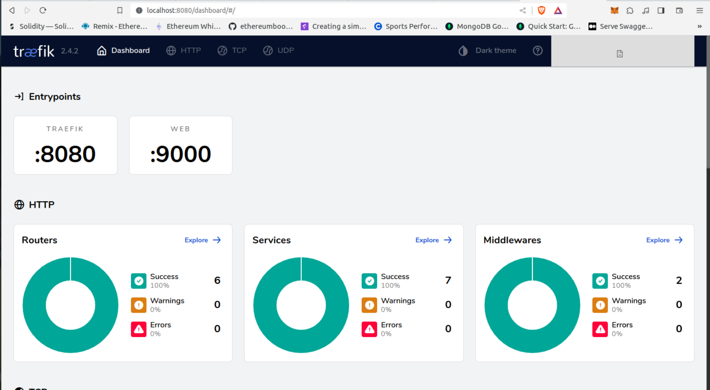

# Localhost Deployment

> **_IMPORTANT:_**  Ensure to have a .env file with the following environment variables defined.
```bash
MONGO_USER={your mongodb user}
MONGO_PASSWORD={your mongodb connection password}
MONGO_CLUSTER={your mongodb atlas cluster}
```

## Index

* [Requirements](#requirements)
* [Starting services](#starting-services)
* [Stopping services](#stopping-services)
* [Traefik Proxy dashboard](#traefik-proxy-dashboard)

## Requirements

* Docker Engine  
* Docker Compose
* MongoDB Atlas Account

## Starting services

Use the command `compose build` to build all services.

```bash
docker compose build
```

Use the command `compose up` to start all services in your local environment.

```bash
docker compose up
```

<details>
  <summary>Output</summary>

  ```bash
  [+] Running 7/7
  ⠿ Container content-system-interactions-1    Started
  ⠿ Container content-system-proxy-1    Started
  ⠿ Container content-system-users-1    Started
  ⠿ Container content-system-contents-1    Started
  ```
</details>

Once deployed successfully, all services will be available. example:

| Service | Description |
|---------|-------------|
| [Traefik Proxy Dashboard](http://localhost:8080/dashboard/#/) | Allows you to identify Traefik componentes like routers, provider, services, middlewares among others |
| [List users api](http://localhost:9000/users/) | List all users |
| [List contents api](http://localhost:9000/contents/) | List all stories |

The following command is an example of how to list the users:

```bash
curl -X GET http://localhost:9000/users/
```

<details>
  <summary>Output</summary>

  ```
  {"message": "users fetched","status": "success","users": [{"ID": "653586b3855e05c0a2b36996","name": "Rishan","lastName": "KP","email": "rishan@test.com","phone": "9998887776"}]}  
  ```
</details>

## Stopping services

```bash
docker compose stop
```

<details>
  <summary>Output</summary>

  ```
  [+] Running 7/7
  ⠿ Container content-system-interactions-1    Stopped
  ⠿ Container content-system-proxy-1    Stopped
  ⠿ Container content-system-users-1    Stopped
  ⠿ Container content-system-contents-1    Stopped
  ```
</details>

## Traefik Proxy dashboard

This project use Traefik Proxy v2.4.2, [the dashboard should look like this image](http://localhost:8080/dashboard/#/):



Next: [Endpoints](endpoints.md)
